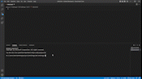

#   Challenge 08 - Object-Oriented Programming Challenge: Team Profile Generator

##  User Story

AS A manager
I WANT to generate a webpage that displays my team's basic info
SO THAT I have quick access to their emails and GitHub profiles

## Acceptance Criteria

GIVEN a command-line application that accepts user input
WHEN I am prompted for my team members and their information
THEN an HTML file is generated that displays a nicely formatted team roster based on user input
WHEN I click on an email address in the HTML
THEN my default email program opens and populates the TO field of the email with the address
WHEN I click on the GitHub username
THEN that GitHub profile opens in a new tab
WHEN I start the application
THEN I am prompted to enter the team manager’s name, employee ID, email address, and office number
WHEN I enter the team manager’s name, employee ID, email address, and office number
THEN I am presented with a menu with the option to add an engineer or an intern or to finish building my team
WHEN I select the engineer option
THEN I am prompted to enter the engineer’s name, ID, email, and GitHub username, and I am taken back to the menu
WHEN I select the intern option
THEN I am prompted to enter the intern’s name, ID, email, and school, and I am taken back to the menu
WHEN I decide to finish building my team
THEN I exit the application, and the HTML is generated

---

# Challenge 08

## Purpose
Quickly and easily generate a team profile by using a command-line application to generate one.

## Built With
* HTML
* CSS
* Javascript
* Node.js
* Jest.js
* inquirer.js

## Website
https://rosemariehalim.github.io/08-challenge/

---

## Process

* set up files
* planned out code using old assignments
* installed inquirer and Jest
* created required command-line questions
* created functions to write HTML file
* wrote function to initialize application
* completed function to generate HTML
* Set up CSS styles for page
* tested and fixed code
* Recorded screen and converted mp4 into GIF